# 🛡️ SupplyShield

## Autonomous Multi-Agent Supply Chain Recovery & Resilience Platform

> **Detect disruption. Reason across the supply chain. Verify recovery. Act safely.**

<p align="center">
  <b>Team TWOPOINTERS</b>
  <br/>
  Smart Health &amp; Supply Chain Resilience
  <br/>
  Build with AI: Code for Communities — Second Edition
  <br/><br/>
  🌐 <b><a href="https://supplyshield-app.vercel.app/">Live Demo</a></b>
  <br/>
  <sub>Experience SupplyShield in action — from disruption detection to AI-driven, policy-validated recovery.</sub>
</p>

<p align="center">
  <a href="https://supplyshield-app.vercel.app/">
    
  </a>
</p>

[](https://www.python.org/)
[](https://google.github.io/adk-docs/)
[](https://ai.google.dev/)
[](https://fastapi.tiangolo.com/)
[](https://react.dev/)
[](https://vite.dev/)
[](https://www.docker.com/)

</p>

---

# 🚨 The Problem

Supply-chain disruptions rarely affect only one operational component.

A delayed shipment can simultaneously create:

- 📦 Inventory shortages
- 🏭 Production risk
- 🚚 Logistics constraints
- 🏢 Supplier dependency
- 💰 Financial exposure
- ⚠️ Operational risk
- 🛒 Emergency procurement requirements

Traditional workflows require teams to manually connect these signals across inventory, logistics, suppliers, finance, procurement and risk systems.

This creates three critical problems:

| Problem | Impact |
|---|---|
| Fragmented information | Teams operate on disconnected signals |
| Slow decision-making | Recovery actions take too long |
| Unverified AI recommendations | Incorrect or unauthorized actions can create additional risk |

SupplyShield converts this fragmented process into a **coordinated, observable and policy-governed recovery workflow**.

---

# 💡 The Solution

**SupplyShield** is an AI-powered multi-agent supply-chain resilience platform that investigates disruptions, evaluates downstream impact, identifies recovery options, validates them against deterministic policies, and produces a structured recovery plan.

Instead of asking one general-purpose AI agent to solve the entire problem, SupplyShield decomposes the incident across specialized agents.

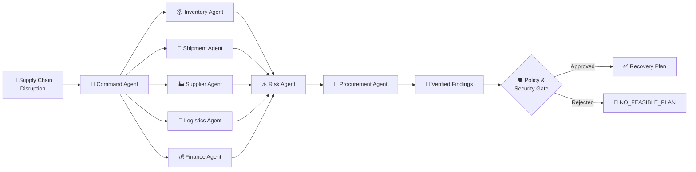

---

# 🧠 Core Principle

> **LLMs reason. Deterministic tools verify. Policies govern. Humans remain in control.**

SupplyShield deliberately separates AI reasoning from operational truth.

| Layer | Responsibility |
|---|---|
| 🤖 AI Agents | Reasoning, coordination and synthesis |
| 🧮 Deterministic Tools | Calculations and source-of-truth operations |
| 🛡️ Security Engine | Authorization and policy enforcement |
| 📊 Control Room | Visualization and operational awareness |
| 🔍 Audit Layer | Traceability and observability |
| 👤 Human Operators | Oversight and authorization |

This architecture prevents the system from treating an LLM-generated response as an automatically executable business decision.

---

# 🤖 Multi-Agent Architecture

SupplyChain recovery is inherently multi-dimensional.

SupplyShield therefore assigns dedicated responsibilities to specialized agents.

| Agent | Responsibility |
|---|---|
| 📦 **Inventory Agent** | Calculates inventory position, runway and shortage exposure |
| 🚢 **Shipment Agent** | Investigates delayed shipments and shipment-level risk |
| 🏭 **Supplier Agent** | Identifies supplier alternatives and supplier constraints |
| 🚚 **Logistics Agent** | Evaluates routes, capacity and expedited transportation |
| 💰 **Finance Agent** | Validates financial constraints and recovery economics |
| ⚠️ **Risk Agent** | Aggregates operational risk across the incident |
| 🛒 **Procurement Agent** | Generates emergency procurement proposals |
| 🎯 **Command Agent** | Coordinates findings and synthesizes the final recovery plan |

Each agent operates within a defined responsibility boundary.

---

# 🏗️ System Architecture

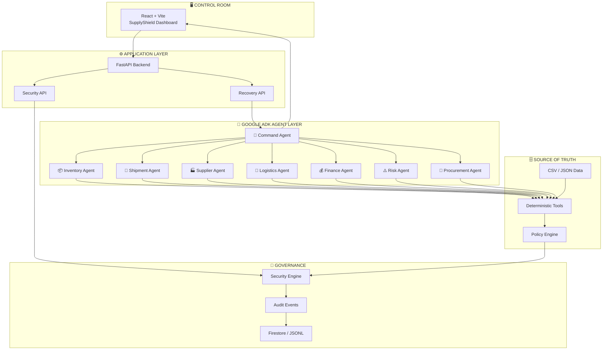

---

# 🔥 Real Recovery Orchestration

SupplyShield does **not** assume that a delayed shipment automatically requires emergency procurement.

For the supplied incident:

### `SHP001`

- Shipment delay: approximately **6 days**
- Available inventory runway: approximately **3.31 days**

The recovery engine evaluates whether the existing delayed shipment can first be used to bridge the runway through an expedited route.

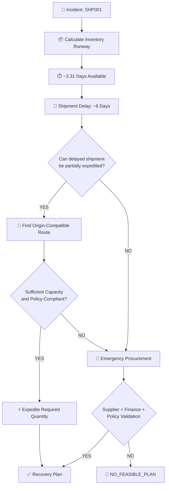

### Recovery priority

The system evaluates:

1. **Existing delayed shipment**
2. **Expedited route feasibility**
3. **Route capacity**
4. **Origin compatibility**
5. **Policy compliance**
6. **Emergency procurement fallback**
7. **Supplier and financial constraints**
8. **Final recovery feasibility**

If no compliant recovery path exists, SupplyShield returns:

```text
NO_FEASIBLE_PLAN
```

It does **not fabricate a successful recovery** simply to produce a positive dashboard result.

---

# 🔄 End-to-End Recovery Flow

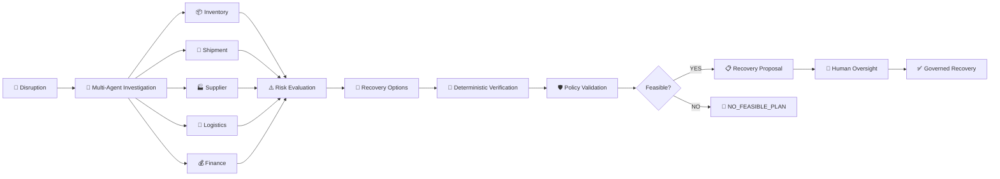

---

# 🔐 Security-First Architecture

Agentic systems should not have unrestricted access to sensitive operational actions.

SupplyShield therefore places a deterministic security engine **before execution**.

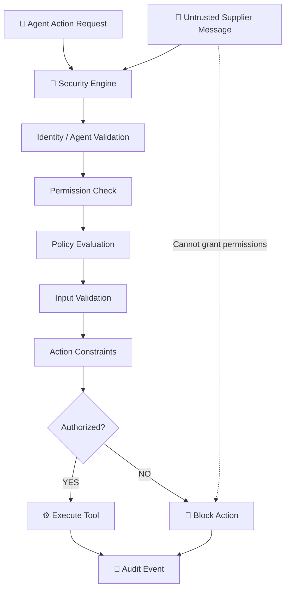

Security policies are centralized in:

```text
data/policies.json
```

External supplier messages are treated as **untrusted data**.

They cannot:

- Grant themselves permissions
- Override security policies
- Execute privileged tools
- Modify authorization rules
- Bypass the security engine

---

# 🧪 Malicious Supplier Demonstration

SupplyShield includes a dedicated security demonstration showing how an untrusted supplier instruction is handled.

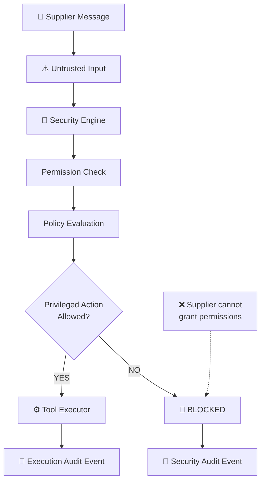

The important property is that the request is stopped **before the privileged executor is reached** when the policy does not permit it.

---

# 📊 Control Room

The React dashboard acts as the operational command center.

### Dashboard visibility

- 🚨 Active disruptions
- 📦 Inventory runway
- 🚢 Delayed shipments
- 🏭 Supplier status
- 🚚 Route options
- 💰 Financial constraints
- 🤖 Agent activity
- ⚠️ Risk indicators
- 🔐 Security events
- 🔄 Recovery timeline
- 📋 Procurement proposals

### Dynamic Recovery Timeline

The recovery timeline is populated from the **actual backend workflow**.

It is not a hardcoded frontend animation.

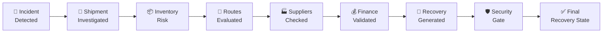

---

# 🧮 Why Deterministic Tools Matter

SupplyShield deliberately avoids letting the LLM invent operational facts.

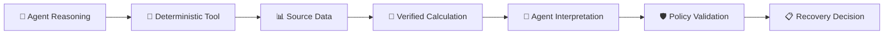

This creates a separation between:

**Reasoning → Verification → Governance → Decision**

rather than:

**Prompt → LLM → Action**

---

# 🧰 Technology Stack

## 🤖 AI / Agentic Layer

- Google ADK
- Gemini
- Multi-agent orchestration
- Structured agent outputs
- Agent-specific tool access

## ⚙️ Backend

- Python
- FastAPI
- Deterministic supply-chain tools
- Policy engine
- CSV / JSON source data
- REST APIs

## 🖥️ Frontend

- React
- Vite
- Component-driven dashboard
- API-driven state
- Real-time recovery visualization

## 🐳 Infrastructure

- Docker
- Docker Compose
- Nginx

## 🔐 Governance

- Security engine
- Policy definitions
- Audit events
- Firestore-compatible audit storage
- Local JSONL fallback

---

# 📁 Project Structure

```text
SupplyShield/
│
├── backend/
│   ├── main.py
│   ├── agents/
│   ├── tools/
│   ├── security/
│   └── ...
│
├── data/
│   ├── policies.json
│   ├── inventory/
│   ├── shipments/
│   ├── suppliers/
│   └── ...
│
├── frontend/
│   ├── src/
│   ├── public/
│   ├── package.json
│   └── vite.config.*
│
├── security/
│   └── audit_log.jsonl
│
├── requirements.txt
├── requirements-dev.txt
├── docker-compose.yml
├── .env.example
├── LICENSE
└── README.md
```

---

# 🔌 API Surface

| Method | Endpoint | Description |
|---|---|---|
| `GET` | `/health` | Backend health check |
| `GET` | `/api/dashboard` | Dashboard data |
| `GET` | `/api/agents` | Agent status |
| `GET` | `/api/inventory` | Inventory information |
| `GET` | `/api/inventory/{product_id}/risk` | Inventory risk |
| `GET` | `/api/shipments/delayed` | Delayed shipments |
| `GET` | `/api/shipments/{shipment_id}` | Shipment details |
| `GET` | `/api/shipments/{shipment_id}/risk` | Shipment risk |
| `GET` | `/api/suppliers/product/{product_id}` | Supplier information |
| `GET` | `/api/suppliers/options/{product_id}` | Alternative suppliers |
| `GET` | `/api/routes/best` | Route evaluation |
| `GET` | `/api/finance/policy` | Financial policy |
| `POST` | `/api/finance/check` | Financial validation |
| `POST` | `/api/recovery` | Execute recovery orchestration |
| `GET` | `/api/purchase-orders` | Purchase-order state |
| `POST` | `/api/purchase-orders/proposals` | Generate PO proposal |
| `GET` | `/api/security/events` | Security audit events |
| `GET` | `/api/security/policies` | Active security policies |
| `POST` | `/api/security/evaluate` | Evaluate an action |
| `POST` | `/api/security/demo/supplier-export` | Malicious supplier demonstration |

---

# 📡 Recovery API

### Standard recovery request

```json
{
  "shipment_id": "SHP001"
}
```

### Replan while excluding a disrupted supplier

```json
{
  "shipment_id": "SHP001",
  "exclude_supplier_ids": [
    "SUP002"
  ]
}
```

The backend performs the actual orchestration and returns a structured recovery result to the frontend.

---

# 🧠 Design Principles

### 01 — Deterministic Truth

LLMs are used for reasoning and orchestration.

Critical calculations remain grounded in deterministic tools and source data.

### 02 — No Fabricated Success

If a compliant recovery strategy cannot be found:

```text
NO_FEASIBLE_PLAN
```

is returned.

### 03 — Least Privilege

Agents receive only the capabilities required for their responsibilities.

### 04 — Untrusted Inputs Stay Untrusted

External supplier messages cannot elevate their own permissions.

### 05 — Observable Autonomy

Agent activity and security events are visible and auditable.

### 06 — Human Authorization

The current procurement and shipment tools generate proposals rather than silently modifying external ERP systems.

---

# 🌐 Extensible Enterprise Architecture

SupplyShield uses a replaceable data and tool layer.

The current implementation uses CSV/JSON-backed deterministic tools, while the architecture can evolve toward enterprise systems.

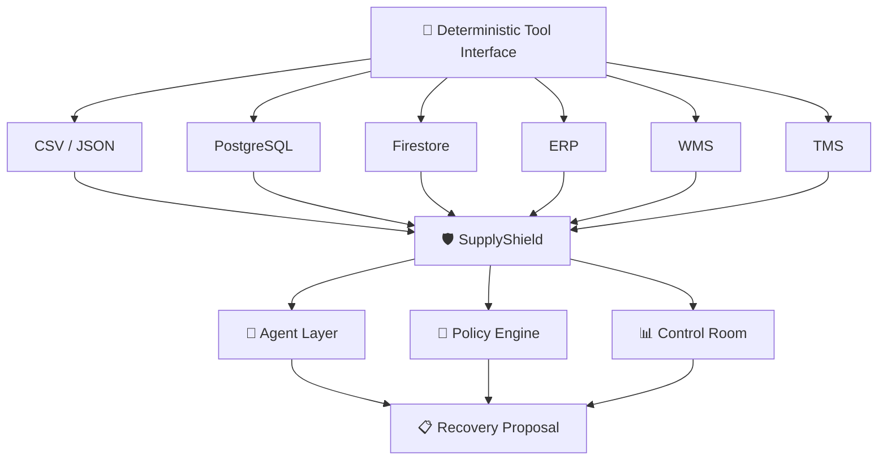

This allows the agent layer to evolve without requiring a complete rewrite of the decision architecture.

---

# 🧪 Testing

Install development dependencies:

```powershell
pip install -r requirements-dev.txt
```

Run the test suite:

```powershell
pytest -q
```

The test suite covers:

- Deterministic tools
- Security guardrails
- Backend health
- API data contracts
- Agent presence
- Recovery orchestration
- Policy enforcement
- Mocked ADK execution

---

# ⚙️ Local Development

## 1. Clone the repository

```powershell
git clone <YOUR_REPOSITORY_URL>
cd SupplyShield
```

## 2. Create virtual environment

```powershell
python -m venv .venv
.venv\Scripts\activate
```

## 3. Install Python dependencies

```powershell
pip install -r requirements.txt
```

## 4. Configure Gemini

Copy:

```text
.env.example
```

to:

```text
.env
```

Set:

```env
GOOGLE_API_KEY=your_key_here
```

> ⚠️ Never commit `.env` to GitHub.

## 5. Start backend

```powershell
uvicorn backend.main:app --reload
```

Backend:

```text
http://127.0.0.1:8000
```

API documentation:

```text
http://127.0.0.1:8000/docs
```

## 6. Start frontend

Open another terminal:

```powershell
cd frontend
npm install
npm run dev
```

Frontend:

```text
http://localhost:5173
```

---

# 🐳 Docker Deployment

Set your Gemini API key in the environment and run:

```powershell
docker compose up --build
```

Open:

```text
http://localhost:5173
```

The frontend Nginx container proxies:

```text
/api/*
```

to the FastAPI backend.

---

# 🔭 Roadmap

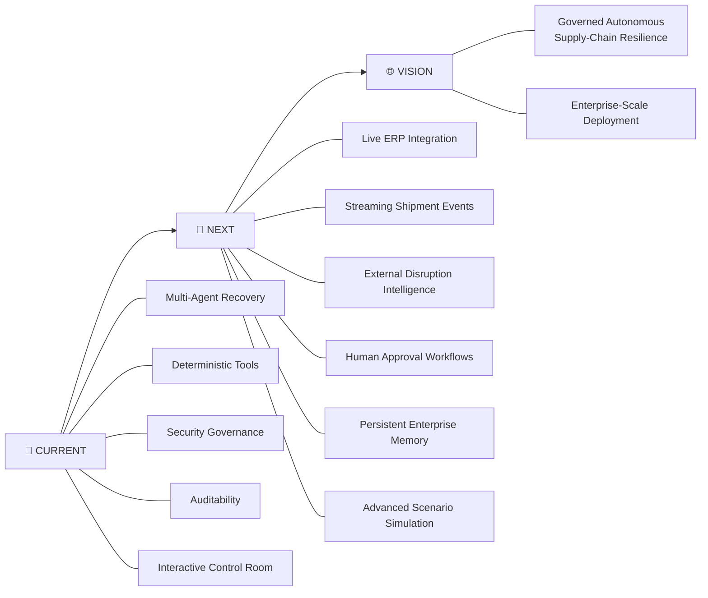

---

# 📈 From Reactive to Resilient

### Traditional Workflow

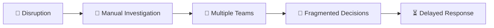

### SupplyShield Workflow

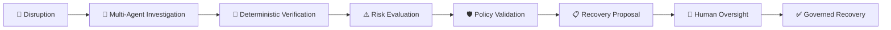

---

# 🏆 Why SupplyShield?

SupplyShield is built around a fundamental distinction:

> **An AI system should not simply generate an answer. It should investigate, verify, respect constraints, explain its decision, and fail safely when no valid answer exists.**

That is why SupplyShield combines:

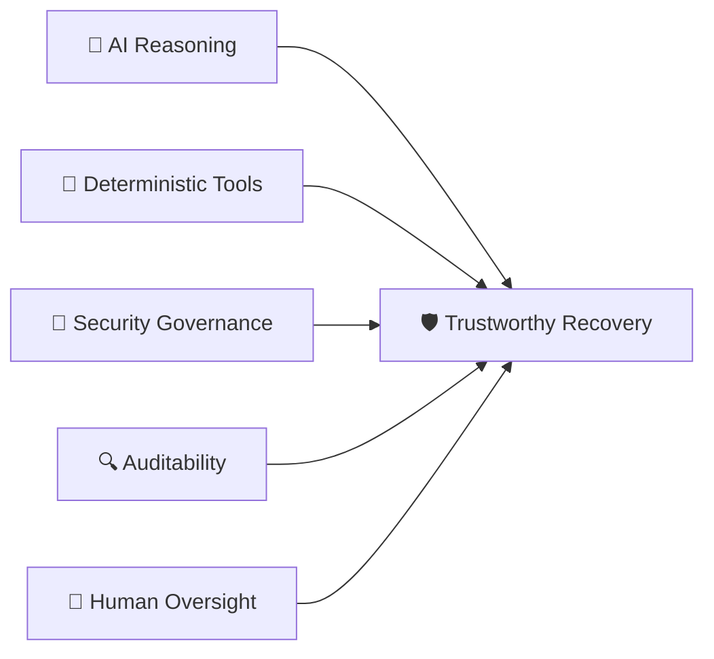

---

# 🎯 What Makes SupplyShield Different?

| Conventional AI Workflow | SupplyShield |
|---|---|
| Single general-purpose agent | Specialized multi-agent architecture |
| LLM-generated facts | Deterministic source-of-truth tools |
| Actions may be loosely controlled | Policy-gated execution |
| External instructions may influence behavior | Untrusted inputs remain untrusted |
| Success-oriented responses | Explicit `NO_FEASIBLE_PLAN` state |
| Limited observability | Auditable security and recovery events |
| Static UI | Backend-driven operational control room |
| AI-only decision | AI + deterministic verification + governance |

---

# 🌍 Enterprise Vision

SupplyShield is designed as a foundation for **governed AI-driven operational resilience**.

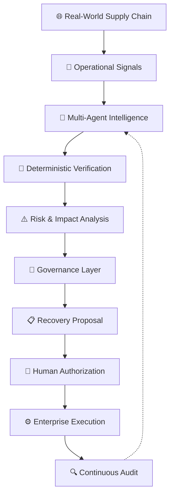

The long-term objective is not simply to build another AI dashboard.

It is to create a **governed operational intelligence layer** that can sit between real-world supply-chain signals and enterprise decision-making systems.

---

# 👥 Team TWOPOINTERS

## SupplyShield

**Track:** Smart Health & Supply Chain Resilience

### Built with

- 🤖 Agentic AI
- 🧠 Multi-Agent Systems
- ⚙️ Deterministic Decision Tools
- 🛡️ Security Governance
- 📊 Data-Driven Operations
- 🌐 Full-Stack Engineering

---

# 🏁 Submission

## Build with AI: Code for Communities — Second Edition

**Hack2Skill**

🔗 https://hack2skill.com/event/codeforcommunities2/

SupplyShield is submitted as a software-first solution focused on:

> **Smart Health & Supply Chain Resilience**

The platform combines:

**Google ADK + Gemini + Multi-Agent Systems + Deterministic Decision Tools + Security Governance + React + FastAPI**

---

# 📜 License

SupplyShield is released under the **MIT License**, permitting free use, modification, distribution, and private or commercial use, subject to the terms of the license.


---

<div align="center">

# 🛡️ SUPPLYSHIELD

### Detect. Reason. Verify. Recover.

**Team TWOPOINTERS**

<br/>

*Autonomous supply-chain resilience, built with governed AI.*

</div>
